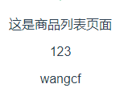
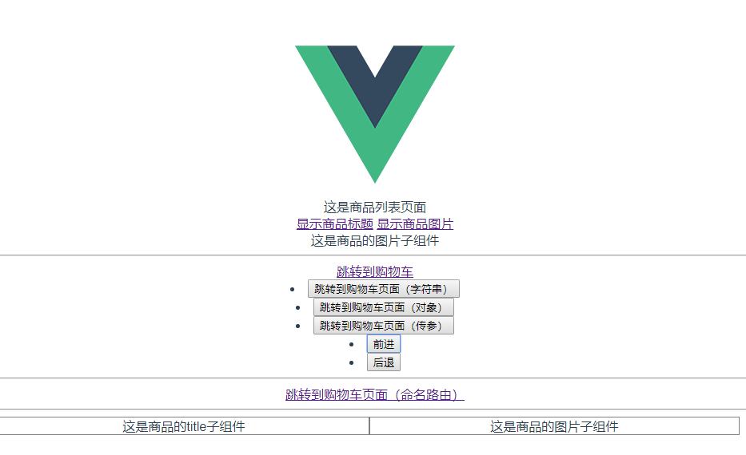

## 前端路由

- 服务器端路由：的功能是根据URL地址，跳转到相应页面，这些页面都是真实存在于服务端的
- 前端路由：由前端实现以上功能，前端只存在d单页面首页index.htm

### 优点

- 不需要每次都从服务器获取，渲染页面更快速

### 缺点

- 不利于SEO
- 使用浏览器前进、后退按键时重新发送请求，未合理利用缓存
- 单页面无法记住之前滚动的位置

## 前端路由的使用
- vue-router用来构建SPA
- 跳转：html页面：`<router-link></router-link>` 或者 js:this.$router.push({path:})
- 渲染：`<router-view></router-view>`

### 动态路由匹配

规定URL格式，获取URL内容；
使用场景：共用页面，如商品详情，只是商品的id不同

模式 | 匹配路径 | $route.params
-------|------|------
/user/:username | /user/enent |{ username: 'event' }
/user/:username/post/:post_id |/user/event/post/123|{username: 'event', post_id: 123}

**实例:**

1.创建vue页面

```
<template>
  <div>
    这是商品列表页面
    <p>{{$route.params.goosdId}}</p>
    <p>{{$route.params.userName}}</p>
  </div>
</template>

<script>
    export default {
        name: "goods-list"
    }
</script>

<style scoped>

</style>

```

2.修改/router/index.js

```
import GoodsList from'@/views/GoodsList'

Vue.use(Router)

export default new Router({
  routes: [
    //mode: 'history',//默认为`hash`哈希模式
    {
      path: '/goods/:goosdId/user/:userName',
      name: 'GoodsList',
      component: GoodsList
    }
  ]
})
```

3.输入地址

`http://localhost:8080/#/goods/123/user/wangcf`

4.输出结果



>vue-router是对history对象的封装;
地址中的 `#` 是指定路由模式，可以修改为`history`

- history.go()：前进
- history.back()：后退
- history.pushState('desc','test','/#/goods/123/user/wangcf')：跳转

### 嵌套路由

>路由之中嵌套路由；通过嵌套路由实现不同页面之间的切换

**实例**

1.新建组件Image.vue,Title.vue

```
<div>
      这是商品的 图片/标题 子组件
</div>
```

2.在GoodsList.vue中添加

```
<!--嵌套路由子路由-->
    <div>
      <router-link to="/goods/title">显示商品标题</router-link>
      <router-link to="/goods/img">显示商品图片</router-link>
    </div>
    <div>
          <!--在页面中渲染的位置-->
          <router-view></router-view>
    </div>
```

3.配置路由设置,添加子路由

```
children:[
        {
          path: 'title',
          name: 'title',
          component: Title
        },
        {
          path: 'img',
          name: 'img',
          component: Image
        }
```

4.访问 `http://localhost:8080/goods`


### 编程式路由

通过Js来实现页面的跳转

- 字符串：$router.push('/name')
- 路由地址：$router.push({path:'name'})
- 传参：$router.push({path:'name?a=123'}) 或者 $router.push({path:'name',query:{a:123}})
- $router.go(1)

**例子：**

1.商品列表页面

```
<template>
  <div>
    <!--编程式路由-->
    <div>
      <router-link to="/cart">跳转到购物车</router-link>
      <li><button @click="jumpStr">跳转到购物车页面（字符串）</button></li>
      <li><button @click="jumpObj">跳转到购物车页面（对象）</button></li>
      <li><button @click="jumpQue">跳转到购物车页面（传参）</button></li>
      <li><button @click="jumpGo">前进</button></li>
      <li><button @click="jumpBack">后退</button></li>
    </div>

  </div>
</template>

<script>
    export default {
        methods:{
          jumpStr(){
            this.$router.push('/cart')
          },
          jumpObj(){
            this.$router.push({path:'cart'})
          },
          jumpQue(){
            this.$router.push({path:'cart',query:{goodsId:123}})
          },
          jumpGo(){
            this.$router.go(1)
          },
          jumpBack(){
            this.$router.go(-1)
          }

        }
    }
</script>
```

2.购物车页面
注意这里是用的route而不是router
并且获取参数是用query而不是params和动态路由传参有区别

```
<div>
      这是购物车页面
      <p>{{$route.query.goodsId}}</p>
</div>
```

### 命名路由和命名视图

给路由和视图(组件)定义名称，通过名称进行渲染

**命名路由例子**

1.为路由命名

```
    {
      path: '/cart/:cartId',
      name: 'cart',//路由名称
      component: Cart
    }
```

2.使用 `v-bind:to="{name:'cart'},params:{cartId:321}"` 添加跳转

- name:路由名称
- params，可选:路由参数(动态路由)

```
    <div>
      <router-link v-bind:to="{ name:'cart'，params:{cardId:321} }">跳转到购物车页面（命名路由）</router-link>
    </div>
```

**命名视图例子**

1.在router/index中配置命名视图

```
      //命名视图
      components: {
        default: GoodsList,
        title: Title,
        img: Image
      },
```

2.在App.vue中显示视图

```
  <div id="app">
    
    <router-view class="main"/>
    <router-view class="left" name="title"></router-view>
    <router-view class="right" name="img"></router-view>
  </div>
```



详细代码代码文件

- [src/router/index.js](../src/router/index.js)
- [src/views/Cart.vue](../src/views/Cart.vue)
- [src/views/GoodsList.vue](../src/views/GoodsList.vue)
- [src/views/Image.vue](../src/views/Image.vue)
- [src/views/Title.vue](../src/views/Title.vue)
